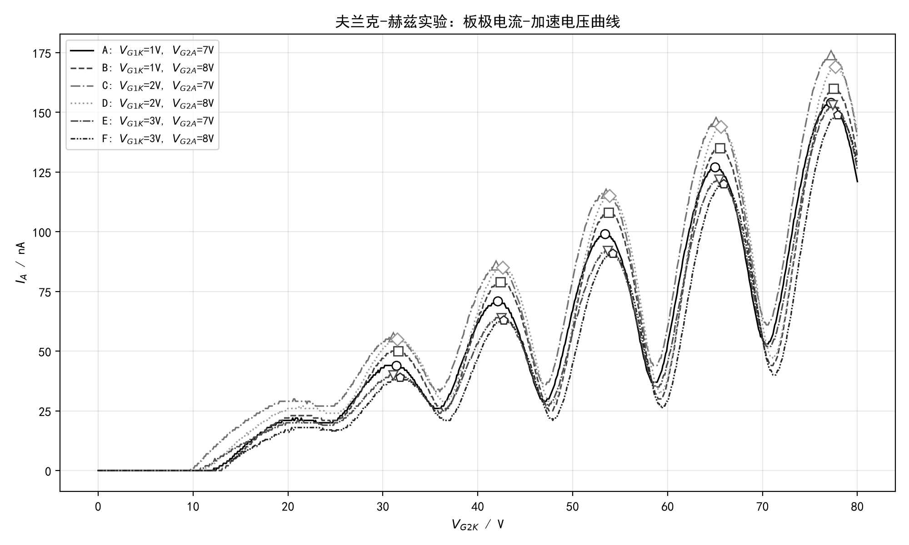
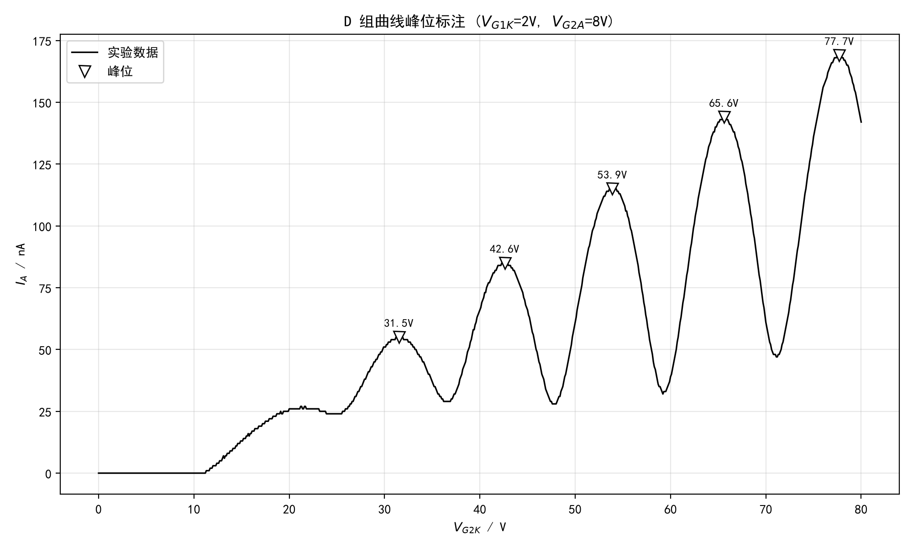
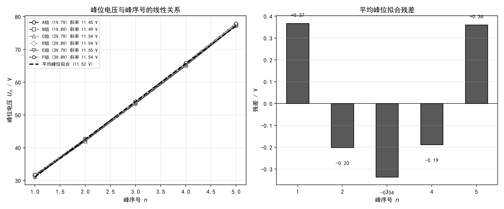

# 夫兰克-赫兹实验报告

**实验名称：** 夫兰克-赫兹实验（测量氩原子的第一激发电位）
**实验日期：** 2026-09-28　**环境温度：** 25 ℃　**仪器号：** 1

---

## 一、实验目的

1. 测定氩（Ar）原子的第一激发电位，验证原子内部能量量子化的事实；
2. 学习夫兰克-赫兹实验中板极电流随加速电压周期性变化的规律；
3. 掌握用**逐差法**处理等间隔测量数据并计算物理量的方法。

## 二、实验原理

夫兰克-赫兹管中充有低压氩气。阴极 K 发出的电子经第一栅极 $G_1$ 加速（消除阴极附近空间电荷的影响），在加速电压 $V_{G_2K}$ 作用下向第二栅极 $G_2$ 运动。若电子动能小于氩原子的第一激发能 $eU_0$，则电子与氩原子发生**弹性碰撞**，能量损失可忽略，能到达板极 A，板流 $I_A$ 随 $V_{G_2K}$ 增大而上升。当电子动能达到

$$eU_0 = \frac{1}{2}mv^2$$

时，电子与氩原子发生**非弹性碰撞**，把能量 $eU_0$ 交给氩原子使其跃迁到第一激发态，电子剩余动能很小，几乎无法克服拒斥电压 $V_{G_2A}$ 到达板极，$I_A$ 急剧下降形成**峰**。$V_{G_2K}$ 继续增大，电子在碰撞后仍保留足够动能，$I_A$ 回升；当电子在 $G_2$ 前连续两次非弹性碰撞时，$I_A$ 再次下降形成**谷**……于是 $I_A$–$V_{G_2K}$ 曲线呈现周期性起伏。

相邻两峰（或两谷）对应的加速电压之差即氩原子的第一激发电位：

$$\Delta U = U_{n+1} - U_n \approx U_0$$

若峰位电压与峰序号 $n$ 满足线性关系 $U_n = U_1 + (n-1)\,\Delta U$，则其斜率即为 $\Delta U$。氩原子第一激发电位的参考值为 $U_0 = 11.55$ eV。

## 三、实验装置与参数

- 灯丝电压 $V_F = 2.1$ V（恒定）
- 扫描范围 $V_{G_2K}$：0 – 80 V，步距 0.1 V，每点停留 0.5 s
- 电流量程：1 nA
- 改变第一栅压 $V_{G1K}$（1/2/3 V）与拒斥电压 $V_{G2A}$（7/8 V），共测量 6 组曲线，以研究各参量对波形的影响。各组实验条件如下表：

| 组别 | A | B | C | D | E | F |
|---|---|---|---|---|---|---|
| $V_{G1K}$ / V | 1 | 1 | 2 | 2 | 3 | 3 |
| $V_{G2A}$ / V | 7 | 8 | 7 | 8 | 7 | 8 |

## 四、实验数据与波形

6 组 $I_A$–$V_{G_2K}$ 曲线如图 1 所示，均呈现清晰、规则的周期性振荡，共观测到 5 个峰；波谷略滞后于峰，且随 $V_{G_2K}$ 增大峰高逐渐升高（加速电压越高，到达板极的电子越多，本底电流越大）。

各曲线峰位电压（Savgol 平滑后 `find_peaks` 自动寻峰，平滑窗口仅用于定位，不改变原始数据）：

| 峰序号 n | A (1V,7V) | B (1V,8V) | C (2V,7V) | D (2V,8V) | E (3V,7V) | F (3V,8V) | 平均 |
|---|---|---|---|---|---|---|---|
| 1 | 31.40 | 31.60 | 31.10 | 31.50 | 31.10 | 31.80 | 31.42 |
| 2 | 42.10 | 42.40 | 41.90 | 42.60 | 42.50 | 42.70 | 42.37 |
| 3 | 53.40 | 53.80 | 53.50 | 53.90 | 53.70 | 54.20 | 53.75 |
| 4 | 65.00 | 65.50 | 65.10 | 65.60 | 65.40 | 65.90 | 65.42 |
| 5 | 77.20 | 77.50 | 77.20 | 77.70 | 77.40 | 77.90 | 77.48 |

（表中括号为 $(V_{G1K}, V_{G2A})$，单位 V；电压读数误差 ±0.05 V）

以 D 组曲线为例的峰位标注见图 2：

## 五、数据处理——逐差法

### 1. 逐差法原理

各峰位满足 $U_n = U_1 + (n-1)\Delta U$。若只用相邻峰差 $\Delta U_n = U_{n+1}-U_n$，每个差值只用到两个数据且不能充分利用测量范围；**逐差法**将相隔 $k$ 项的数据相减再除以 $k$：

$$\Delta U^{(k)}_j = \frac{U_{j+k} - U_j}{k},\qquad k = 2, 3,\ \dots$$

本实验每组 5 个峰，取 $k=2$ 与 $k=3$，每组得到 6 个独立估计：

- $k=2$：$(U_3-U_1)/2$，$(U_4-U_2)/2$，$(U_5-U_3)/2$
- $k=3$：$(U_4-U_1)/3$，$(U_5-U_2)/3$

（$U_5-U_1$ 与上列估计线性相关，不重复计入。）

### 2. 逐差计算结果

以平均峰位为例，演示一组计算：

$$\frac{U_3-U_1}{2}=\frac{53.75-31.42}{2}=11.17\ \text{V},\quad
\frac{U_4-U_2}{2}=\frac{65.42-42.37}{2}=11.52\ \text{V},\quad
\frac{U_5-U_3}{2}=\frac{77.48-53.75}{2}=11.87\ \text{V}$$

$$\frac{U_4-U_1}{3}=\frac{65.42-31.42}{3}=11.33\ \text{V},\quad
\frac{U_5-U_2}{3}=\frac{77.48-42.37}{3}=11.70\ \text{V}$$

6 条曲线共 $6\times 6 = 36$ 个逐差估计值，汇总如下：

| 组别 | 6 个逐差估计值 / V | 均值 / V | 标准差 / V |
|---|---|---|---|
| A | 11.00, 11.45, 11.90, 11.20, 11.70, 11.45 | 11.450 | 0.326 |
| B | 11.10, 11.55, 11.85, 11.30, 11.70, 11.48 | 11.496 | 0.270 |
| C | 11.20, 11.60, 11.85, 11.33, 11.77, 11.53 | 11.546 | 0.249 |
| D | 11.20, 11.50, 11.90, 11.37, 11.70, 11.55 | 11.536 | 0.246 |
| E | 11.30, 11.45, 11.85, 11.43, 11.63, 11.58 | 11.540 | 0.191 |
| F | 11.20, 11.60, 11.85, 11.37, 11.73, 11.53 | 11.546 | 0.238 |

合并全部 36 个估计：

$$\overline{\Delta U} = \frac{1}{36}\sum_i \Delta U_i = 11.52\ \text{V}$$

### 3. 不确定度评定（A 类）

样本标准差：

$$s = \sqrt{\frac{1}{35}\sum_i(\Delta U_i-\overline{\Delta U})^2} = 0.24\ \text{V}$$

平均值的标准不确定度：

$$u_A(\Delta U) = \frac{s}{\sqrt{36}} = 0.04\ \text{V}$$

电压读数误差 ±0.05 V 对应的 B 类分量 $u_B \approx 0.03/\sqrt{3}\approx 0.02$ V，合成后 $u_C \approx 0.05$ V，故最终结果表示为

$$\boxed{\Delta U = (11.52 \pm 0.05)\ \text{V}}$$

### 4. 与参考值比较

相对误差：

$$E_r = \frac{|11.52 - 11.55|}{11.55}\times 100\% = 0.27\%$$

在参考值 $11.55$ eV 的不确定度范围内符合得很好。

### 5. 线性拟合验证（辅助方法）

将各峰位电压对峰序号 $n$ 作最小二乘拟合 $U_n = a + b\,n$，斜率 $b$ 即为激发电位的另一独立估计：

6 条曲线拟合斜率为 11.45 – 11.55 V（平均 11.52 V），与逐差法结果完全一致；平均峰位拟合残差均小于 0.4 V（见图 3 右），说明 $U_n$–$n$ 线性关系良好，逐差法的前提成立。## 六、结果与讨论

1. **测量结果**：氩原子第一激发电位 $\Delta U = (11.52 \pm 0.05)$ V，与参考值 11.55 eV 的相对偏差仅 0.27%。实验直接证实了原子只能吸收确定份额的能量（$eU_0$），即原子能级的量子化。

2. **工作参量对波形的影响**（对比 6 组曲线）：
   - **拒斥电压 $V_{G2A}$** 越大（8 V vs 7 V），到达板极的电子需克服的势垒越高，谷位电流更小、峰谷对比度更好，波形更清晰；
   - **第一栅压 $V_{G1K}$** 主要影响阴极附近的空间电荷分布：$V_{G1K}$ 从 1 V 增至 3 V，峰位略向高电压方向移动（第一峰从 31.4 V 移至 31.8 V），峰高总体增大，但 $V_{G1K}$ 过大（3 V）时低电压段的本底电流明显抬升；
   - 各曲线的峰间距在 11.45 – 11.58 V 之间，差别远小于峰位本身的差别，说明 $\Delta U$ 是管内气体的本征参量，与工作电压的选择基本无关。

3. **曲线起始段（0 – 12 V 电流为零、12 – 24 V 的台阶）**：加速电压低于约 12 V 时电子无法到达板极（动能不足以克服拒斥场），电流为零；随后电流上升并在 20 – 24 V 附近出现台阶，这是阴极与 $G_1$ 之间加速区段造成的电子能量分组现象，属正常现象，不影响峰间距测量。

4. **误差来源分析**：
   - 峰位判读误差（电压步距 0.1 V，平滑与寻峰引入约 ±0.1 – 0.2 V 的不确定度）——本实验主要的 A 类误差来源；
   - 灯丝电压、拒斥电压的微小漂移导致峰位缓慢移动（对比 C 组与 D 组：仅 $V_{G2A}$ 改变 1 V，各峰移动约 0.1 – 0.4 V，但间距几乎不变，说明逐差/拟合方法能有效抵消系统漂移）；
   - 管内氩气压强、温度的波动会引起自由程分布变化，使峰形展宽、峰位弥散；
   - 接触电势差使第一峰位置偏离 $n=1$ 的线性外推值（拟合截距约 20 V 而非 11.55 V），这是夫兰克-赫兹管的固有效应，采用逐差法取间距而非绝对峰位正好消除了这一系统误差。

5. **结论**：逐差法充分利用了全部测量数据、扩大了电压差取值范围，有效抑制了缓慢漂移和零点偏移等系统误差。本实验测得氩原子第一激发电位为 **11.52 V**，与公认值 11.55 eV 在误差范围内一致，验证了玻尔原子能级量子化理论。

## 附：数据处理说明

| 项目 | 说明 |
|---|---|
| 数据读取 | 读取仪器导出记录，0–80 V 共 801 个数据点 |
| 寻峰 | Savgol 平滑（窗口 11、3 阶，仅用于定位）后 `scipy.find_peaks` 自动寻峰 |
| 逐差计算 | 每组取隔 2 项、隔 3 项共 6 个逐差估计，6 组合并 36 个 |
| 线性拟合 | 峰位电压对峰序号最小二乘拟合，斜率与逐差法互验 |
| 附图 | 图 1 六组曲线对比；图 2 D 组峰位标注；图 3 线性拟合与残差 |
